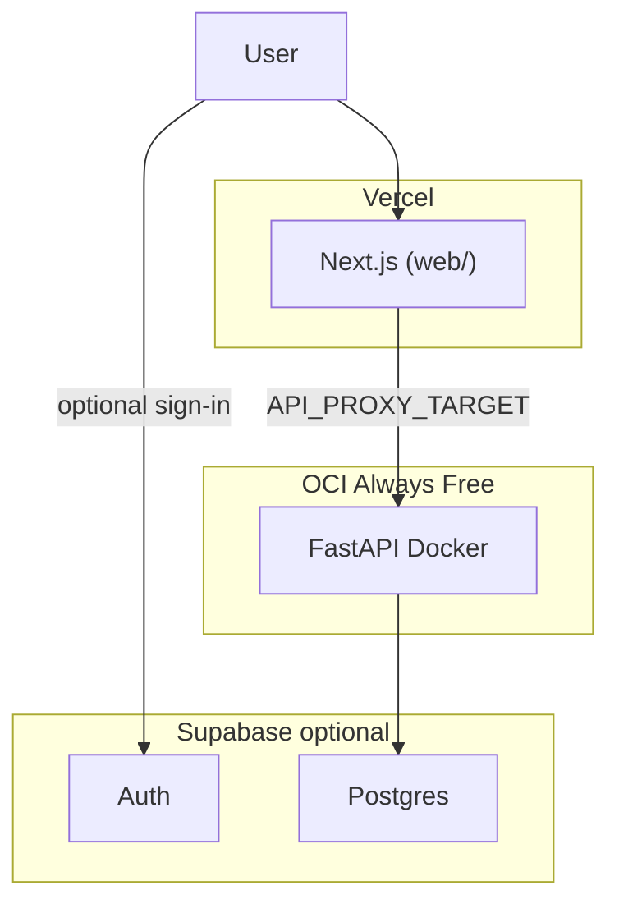

# PRAXIS Web deployment

**Recommended ($0):** [OCI + Vercel + Supabase](DEPLOYMENT_OCI.md)

Also documented: Render, local Docker, Fly.io.



---

## Quick start: OCI + Vercel

See **[DEPLOYMENT_OCI.md](DEPLOYMENT_OCI.md)** for the full Oracle Cloud guide (Ampere VM, Docker API, Cloudflare Tunnel, Supabase).

Summary:

1. OCI Ampere VM (2 OCPU, 12 GB RAM) → `docker compose -f docker-compose.oci.yml up -d --build`
2. Cloudflare Tunnel → HTTPS URL for the API
3. Vercel root `web`, `API_PROXY_TARGET` = tunnel URL
4. Supabase free Postgres in `api/.env` `DATABASE_URL`

---

## Quick start: Render + Vercel

### Step 1 — Push code to GitHub

Repo: **Sousa-16/PRAXISWeb** (only the `WebApp` folder contents).

```bash
cd ~/PRAXIS/WebApp
git push -u origin main
```

### Step 2 — Deploy API on Render

1. Go to [render.com](https://render.com) → sign in with GitHub.
2. **New** → **Blueprint**.
3. Connect **Sousa-16/PRAXISWeb**.
4. Render reads [`render.yaml`](render.yaml) and creates:
   - **praxis-api** (Docker web service)
   - **praxis-db** (Postgres)
5. When prompted, set:
   - `FRONTEND_ORIGIN` → leave blank for now; set after Vercel deploy, e.g. `https://your-app.vercel.app`
   - `SUPABASE_JWT_SECRET` → leave blank unless using Supabase Auth
6. Click **Apply**. Wait for deploy (first build ~5–10 min).
7. Copy the API URL, e.g. `https://praxis-api.onrender.com`.
8. Test: open `https://praxis-api.onrender.com/health` → `"ok": true`.

**Manual deploy (no Blueprint):**

1. **New** → **Web Service** → connect repo.
2. **Root Directory:** leave empty (repo root).
3. **Language:** Docker.
4. **Dockerfile Path:** `api/Dockerfile`.
5. **Docker Context:** `api`.
6. **Plan:** Starter (recommended; PRAXIS fits need RAM).
7. Add env vars (see table below).
8. **Health Check Path:** `/health`.

| Render env var | Value |
|----------------|--------|
| `DATABASE_URL` | From Render Postgres **Internal** URL, or Supabase pooler URL |
| `FRONTEND_ORIGIN` | Your Vercel URL (set after step 3) |
| `COOKIE_SECURE` | `1` |
| `SUPABASE_JWT_SECRET` | Optional — Supabase JWT secret |

**Note:** Render free tier spins down when idle and has limited RAM. Use **Starter** for demos with real PRAXIS fits.

### Step 3 — Deploy frontend on Vercel

1. [vercel.com](https://vercel.com) → **Add Project** → import **Sousa-16/PRAXISWeb**.
2. **Root Directory:** `web` ← important.
3. **Environment variables:**

| Variable | Value |
|----------|--------|
| `API_PROXY_TARGET` | `https://praxis-api.onrender.com` (your Render URL, no trailing slash) |
| `NEXT_PUBLIC_SUPABASE_URL` | Optional |
| `NEXT_PUBLIC_SUPABASE_ANON_KEY` | Optional |

4. **Deploy**.

### Step 4 — Link frontend and API

1. Copy your Vercel URL, e.g. `https://praxis-web.vercel.app`.
2. In **Render** → **praxis-api** → **Environment** → set:
   - `FRONTEND_ORIGIN` = your Vercel URL
3. **Save** (triggers redeploy).
4. Open Vercel URL → try **Use Sample Email Spam Detection**.

---

## Database options

| Option | Where to set `DATABASE_URL` |
|--------|----------------------------|
| **Render Postgres** | Render dashboard → database → **Internal Database URL** (on API service) |
| **Supabase Postgres** | Supabase → Database → **Transaction pooler** URI (port 6543) |

Tables are created automatically on API startup (Alembic).

---

## Supabase Auth (optional)

Skip entirely for guest-only mode.

1. Supabase → **Project Settings** → **API**:
   - **Project URL** → Vercel `NEXT_PUBLIC_SUPABASE_URL`
   - **anon public** → Vercel `NEXT_PUBLIC_SUPABASE_ANON_KEY`
   - **JWT Secret** → Render `SUPABASE_JWT_SECRET`
2. Supabase → **Authentication** → **Providers** → enable **Email**.
3. Redeploy Vercel and Render after setting vars.

---

## Local development

```bash
cd WebApp
docker compose up --build
```

- Web: http://localhost:3000  
- API: http://localhost:8765  

Or without Docker:

```bash
# terminal 1
cd api && uvicorn app.main:app --host 127.0.0.1 --port 8765 --reload
# terminal 2
cd web && npm run dev
```

---

## Health check

`GET /health` on the API returns `database`, `storage`, `auth`, and `ok`.

---

## Limitations

- **In-memory fit cache** is lost when Render restarts or redeploys; run **Find good rules** again for TimberTrek expand.
- **Ephemeral disk** on Render: match-count NPZ cache may not survive redeploys unless you add a Render disk (paid) or S3 storage (see `api/.env.example`).
- CSV bytes live in Postgres — fine for demo sizes.

---

## Alternatives

- **Fly.io:** see [`api/fly.toml`](api/fly.toml)
- **Railway:** same Docker image, set `PORT` from platform
- **Local only:** no Vercel or Render required
