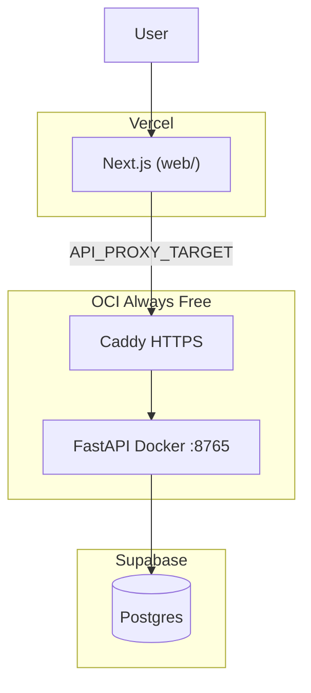

# PRAXIS Web deployment

**Live stack ($0):** Vercel frontend + OCI API + DuckDNS/Caddy HTTPS + Supabase Postgres.

| Guide | Use for |
|-------|---------|
| **[DEPLOYMENT_OCI.md](DEPLOYMENT_OCI.md)** | Oracle VM, Docker API, Supabase, Vercel env vars |
| **[ops/CADDY_DUCKDNS.md](ops/CADDY_DUCKDNS.md)** | Stable API hostname (production) |
| **[SECURITY.md](SECURITY.md)** | Guest isolation, rate limits, operator checklist |



**Live URLs (example):**

- Frontend: `https://praxis-web-nu.vercel.app`
- API (backend only): `https://praxis-web-api.duckdns.org`

Visitors only see the Vercel URL. Next.js rewrites `/v1/*` to `API_PROXY_TARGET`.

---

## Quick start: OCI + Vercel (recommended)

1. **OCI** — Ampere VM, `docker compose -f docker-compose.oci.yml up -d --build` ([full guide](DEPLOYMENT_OCI.md))
2. **HTTPS** — DuckDNS + Caddy on the VM ([full guide](ops/CADDY_DUCKDNS.md))
3. **Vercel** — root directory `web`, `API_PROXY_TARGET` = your Caddy HTTPS URL (no trailing slash)
4. **Supabase** — `DATABASE_URL` in `api/.env` (transaction pooler, port 6543)
5. **CORS/cookies** — `FRONTEND_ORIGIN` on the API must exactly match the Vercel URL

**Ship loop after setup:**

| Changed | Action |
|---------|--------|
| `web/` | `git push` → Vercel redeploys automatically |
| `api/` | SSH to VM → `git pull` or rsync → `docker compose -f docker-compose.oci.yml up -d --build api` |

---

## Local development

**Docker (API + web):**

```bash
cd WebApp
docker compose up --build
```

- Web: http://localhost:3000
- API: http://localhost:8765

**Without Docker:**

```bash
# terminal 1
cd api && uvicorn app.main:app --host 127.0.0.1 --port 8765 --reload

# terminal 2
cd web && npm ci && npm run dev
```

Local web uses `API_PROXY_TARGET=http://127.0.0.1:8765` (see `web/.env.example`).

---

## Database

Set `DATABASE_URL` in `api/.env`:

| Option | Notes |
|--------|--------|
| **Supabase Postgres** | Recommended for production (free tier). Use the **transaction pooler** URI (port 6543). |
| **SQLite** | Default in local `docker-compose.yml` only. |

Alembic migrations run on API startup.

---

## Health check

`GET /health` on the API returns:

| Field | Meaning |
|-------|---------|
| `ok` | `true` when database and storage are ready |
| `database` | Postgres/SQLite reachable |
| `storage` | NPZ cache directory writable |
| `job_queue` | Always `thread` (in-process fits) |

Example: `curl https://praxis-web-api.duckdns.org/health`

---

## After API restart

- **Set Tree Rules** match counts can use the saved NPZ bases index.
- **Browse Trees** can reuse a saved profile when bans/keeps match the last Continue; otherwise run **Find good rules** again.
- **TimberTrek expand** may need the live fit (pickle sidecar helps Browse, not always expand).

---

## Alternative: Render + Vercel

Use this only if you prefer managed hosting over OCI. The repo includes [`render.yaml`](render.yaml) for a Render Blueprint (API + Postgres).

1. Render → **New** → **Blueprint** → connect **Sousa-16/PRAXISWeb**
2. Set `FRONTEND_ORIGIN` after Vercel deploy
3. Vercel `API_PROXY_TARGET` = your Render API URL (e.g. `https://praxis-api.onrender.com`)

**Tradeoffs vs OCI:**

| | OCI + DuckDNS | Render |
|---|---|---|
| Cost | $0 Always Free | Free tier sleeps; Starter plan for RAM |
| Fit RAM | 12 GB Ampere | Starter recommended |
| Disk | Persistent on VM | Ephemeral unless you add paid disk/S3 |
| Ops | SSH + Docker | Dashboard only |

See `api/.env.example` for optional S3 object storage on Render.

---

## Other platforms

- **Fly.io** — [`api/fly.toml`](api/fly.toml) (Docker, persistent volume for NPZ cache)
- **Railway** — same `api/Dockerfile`; set `PORT` from the platform

---

## Troubleshooting

| Problem | Fix |
|---------|-----|
| Vercel UI loads, API calls fail | Check `API_PROXY_TARGET` is HTTPS; Caddy running; OCI security list allows 443 |
| CORS / cookie errors | `FRONTEND_ORIGIN` must exactly match the Vercel URL |
| `/health` `database: false` | Check `DATABASE_URL`; Supabase pooler not paused |
| PRAXIS fit OOM | OCI: use Ampere 12 GB; Render: use Starter plan |
| API URL changed after reboot | Use [DuckDNS + Caddy](ops/CADDY_DUCKDNS.md), not a quick Cloudflare tunnel |
| Demo feels slammed / 429s | Expected under [SECURITY.md](SECURITY.md) limits; wait or lower env caps |
