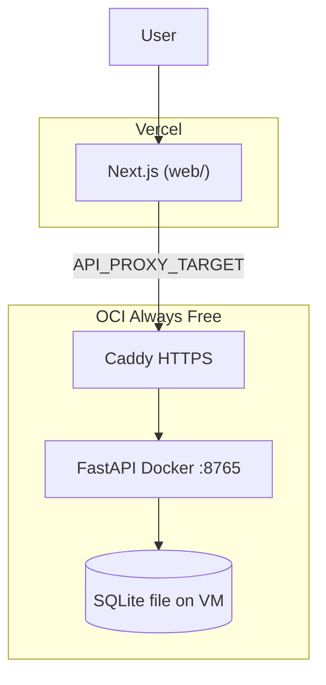

# PRAXIS Web deployment

**Live stack ($0):** Vercel frontend + OCI API + DuckDNS/Caddy HTTPS + **SQLite on the VM**.

There is no Supabase (no Auth, Storage, Realtime, or hosted Postgres). The Next.js app never talks to a database. Guest rows live in a SQLite file that the FastAPI container opens via `DATABASE_URL`.

| Guide | Use for |
|-------|---------|
| **[DEPLOYMENT_OCI.md](DEPLOYMENT_OCI.md)** | Oracle VM, Docker API, SQLite `api/.env`, Vercel env vars |
| **[ops/CADDY_DUCKDNS.md](ops/CADDY_DUCKDNS.md)** | Stable API hostname (production) |
| **[ops/BACKUP.md](ops/BACKUP.md)** | Snapshot SQLite + fit cache on the VM |
| **[SECURITY.md](SECURITY.md)** | Guest isolation, rate limits, operator checklist |



**Live URLs (example):**

- Frontend: `https://praxis-web-nu.vercel.app`
- API (backend only): `https://praxis-web-api.duckdns.org`

Visitors only see the Vercel URL. Next.js rewrites `/v1/*` and `/health` to `API_PROXY_TARGET`.

---

## How a request travels

1. Browser loads the workshop from Vercel.
2. Workshop calls `/v1/...` on the same origin. Next.js proxies that to Caddy on the VM.
3. Caddy terminates TLS and forwards to `127.0.0.1:8765` (not public).
4. FastAPI reads/writes SQLite (`DATABASE_URL`, default `sqlite:///./praxis_web.db`).
5. Fit artifacts (NPZ bases cache, pickles) stay on local disk (`OBJECT_STORAGE_BACKEND=local`). They are not object storage.

SQLAlchemy can open Postgres if you set a `postgresql://` URL. Nothing in the live deploy does that. Alembic migrations still run on API startup for whichever URL is set.

---

## Quick start: OCI + Vercel (recommended)

1. **OCI** - Ampere VM, `docker compose -f docker-compose.oci.yml up -d --build` ([full guide](DEPLOYMENT_OCI.md))
2. **HTTPS** - DuckDNS + Caddy on the VM ([full guide](ops/CADDY_DUCKDNS.md))
3. **Vercel** - root directory `web`. Set:
   - `API_PROXY_TARGET` = your Caddy HTTPS URL (no trailing slash)
   - `PRAXIS_PROXY_SECRET` = same value as on the VM (forwards visitor IP)
4. **SQLite** - Compose mounts guest DB at `/app/praxis_data/praxis_web.db` (named volume). See [ops/BACKUP.md](ops/BACKUP.md).
5. **CORS/cookies** - `FRONTEND_ORIGIN` on the API must exactly match the Vercel URL; `COOKIE_SECURE=1`
6. **Proxy secret** - set the same `PRAXIS_PROXY_SECRET` on the VM `api/.env` and on Vercel so per-IP rate limits see real visitors

**Ship loop after setup:**

| Changed | Action |
|---------|--------|
| `web/` | `git push` → Vercel redeploys automatically |
| `api/` | SSH to VM → `git pull` or rsync → `docker compose -f docker-compose.oci.yml up -d --build api` |

---

## Local development

**Docker (API + web):**

```bash
docker compose up --build
```

- Web: http://localhost:3000
- API: http://localhost:8765

Local compose sets `DATABASE_URL=sqlite:////app/data/praxis_web.db` on a Docker volume.

**Without Docker:**

```bash
# terminal 1
cd api && uvicorn app.main:app --host 127.0.0.1 --port 8765 --reload

# terminal 2
cd web && npm ci && npm run dev
```

Local web uses `API_PROXY_TARGET=http://127.0.0.1:8765` (see `web/.env.example`). Copy [api/.env.example](api/.env.example) if you need overrides. Default database is SQLite in the `api/` directory.

---

## Database

Set `DATABASE_URL` in `api/.env` on the machine that runs the API.

| Option | Where it is used |
|--------|------------------|
| **SQLite** (default) | Local uvicorn, local `docker-compose.yml`, and the live OCI VM |
| **Postgres** | Optional. The API will use it if the URL starts with `postgresql://`. Not configured on the live VM. |

`GET /health` only reports `"database": true` when `SELECT 1` works. It does **not** say which engine you are on. To confirm on the VM:

```bash
cd ~/PRAXISWeb
python3 -c "
from pathlib import Path
from urllib.parse import urlparse
raw = next(l.split('=',1)[1].strip() for l in Path('api/.env').read_text().splitlines() if l.startswith('DATABASE_URL='))
u = urlparse(raw)
print(u.scheme, u.hostname, u.port, raw.startswith('sqlite'))
"
```

SQLite prints `sqlite None None True`. A remote Postgres URL would show a hostname.

---

## Health check

`GET /health` on the API returns:

| Field | Meaning |
|-------|---------|
| `ok` | `true` when database and storage are ready |
| `database` | SQLite (or Postgres, if configured) answered `SELECT 1` |
| `storage` | NPZ cache directory writable |
| `job_queue` | Always `thread` (in-process fits) |

Example: `curl https://praxis-web-api.duckdns.org/health`

---

## After API restart

- Fitted models are pickles under `BASES_CACHE_DIR`; the API reloads them on startup (`fit_cache.warm_from_disk`).
- **Set Tree Rules** match counts can also use the saved NPZ bases index.
- **Browse Trees** can reuse a saved profile when bans/keeps match the last Continue; otherwise run **Find good rules** again.
- **TimberTrek expand** needs a reloaded or live fit bundle.

SQLite lives on the OCI named volume `api_db` (`/app/praxis_data/praxis_web.db`). Guest rows still expire after `GUEST_TTL_HOURS` (default 24). See [ops/BACKUP.md](ops/BACKUP.md).

---

## Alternative: Render + Vercel

Use this only if you prefer managed hosting over OCI. The repo includes [`render.yaml`](render.yaml) for a Render Blueprint (API + Render-hosted Postgres). That is not the live stack.

1. Render → **New** → **Blueprint** → connect **Sousa-16/PRAXISWeb**
2. Set `FRONTEND_ORIGIN` after Vercel deploy
3. Vercel `API_PROXY_TARGET` = your Render API URL (e.g. `https://praxis-api.onrender.com`)

**Tradeoffs vs OCI:**

| | OCI + DuckDNS | Render |
|---|---|---|
| Cost | $0 Always Free | Free tier sleeps; Starter plan for RAM |
| Fit RAM | 12 GB Ampere | Starter recommended |
| Disk | SQLite + cache on the VM | Ephemeral unless you add paid disk/S3 |
| Ops | SSH + Docker | Dashboard only |

See `api/.env.example` for optional S3-compatible object storage on Render.

---

## Other platforms

- **Fly.io** - [`api/fly.toml`](api/fly.toml) (Docker, persistent volume for NPZ cache)
- **Railway** - same `api/Dockerfile`; set `PORT` from the platform

---

## Troubleshooting

| Problem | Fix |
|---------|-----|
| Vercel UI loads, API calls fail | Check `API_PROXY_TARGET` is HTTPS; Caddy running; OCI security list allows 443 |
| CORS / cookie errors | `FRONTEND_ORIGIN` must exactly match the Vercel URL |
| `/health` `database: false` | On the VM, check the SQLite file under `/app/praxis_data` and that the `api_db` volume is mounted |
| PRAXIS fit OOM | OCI: use Ampere 12 GB; Render: use Starter plan |
| API URL changed after reboot | Use [DuckDNS + Caddy](ops/CADDY_DUCKDNS.md), not a quick Cloudflare tunnel |
| Demo feels slammed / 429s | Expected under [SECURITY.md](SECURITY.md) limits; wait or lower env caps |
| IP rate limits never trip | Set matching `PRAXIS_PROXY_SECRET` on Vercel and the VM |
