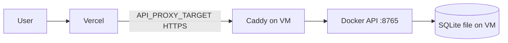

# Deploy on Oracle Cloud (OCI) — $0 Always Free

Stack: **Vercel** (frontend) + **OCI Ampere VM** (API) + **SQLite on the VM**. No hosted database service.



---

## What you need

| Piece | Service | Cost |
|-------|---------|------|
| Frontend | Vercel | Free |
| API | OCI Always Free VM | Free |
| HTTPS to API | DuckDNS + Caddy ([runbook](ops/CADDY_DUCKDNS.md)) | Free |
| Database | SQLite file on the VM (`DATABASE_URL`) | Included |

---

## Part 1 — OCI VM

### 1. Create the instance

1. [cloud.oracle.com](https://cloud.oracle.com) → sign up / sign in.
2. **Compute** → **Instances** → **Create instance**.
3. **Name:** `praxis-api`
4. **Image:** Ubuntu 22.04 or 24.04.
5. **Shape:** **Ampere** → **VM.Standard.A1.Flex**
   - **2 OCPUs**, **12 GB RAM** (fits PRAXIS comfortably; stays within Always Free quota).
6. **Networking:** assign a public IPv4 address.
7. **SSH keys:** generate or upload your public key → download private key.
8. **Create**.

### 2. Open the firewall (OCI + OS)

**OCI console** → **Networking** → **Virtual cloud networks** → your VCN → **Security Lists** → default → **Add Ingress Rules**:

| Source | Port | Purpose |
|--------|------|---------|
| `0.0.0.0/0` | `22` | SSH |
| `0.0.0.0/0` | `80`, `443` | Caddy HTTPS (DuckDNS) |

Port **8765** stays on `127.0.0.1` only — Caddy proxies public 443 to it.

**On the VM** (Ubuntu often has `iptables` too):

```bash
sudo iptables -I INPUT -p tcp --dport 22 -j ACCEPT
# optional if using Caddy:
# sudo iptables -I INPUT -p tcp --dport 80 -j ACCEPT
# sudo iptables -I INPUT -p tcp --dport 443 -j ACCEPT
```

---

## Part 2 — Install Docker on the VM

SSH in:

```bash
# Private key lives in .local-secrets/ (gitignored — never commit it)
ssh -i .local-secrets/<your-oci-key>.key ubuntu@YOUR_PUBLIC_IP
```

Then:

```bash
sudo apt update && sudo apt install -y docker.io docker-compose-v2 git
sudo usermod -aG docker $USER
```

Log out and SSH back in so `docker` works without `sudo`.

---

## Part 3 — Deploy the API

```bash
git clone https://github.com/Sousa-16/PRAXISWeb.git
cd PRAXISWeb
cp api/.env.example api/.env
nano api/.env   # edit values below
```

**Minimum `api/.env` for production:**

```env
# SQLite path is overridden by docker-compose.oci.yml to the named volume:
# sqlite:////app/praxis_data/praxis_web.db
# Keep a local-style URL here only if you run uvicorn without Compose.

FRONTEND_ORIGIN=https://praxis-web-nu.vercel.app
COOKIE_SECURE=1

# Same value as Vercel env PRAXIS_PROXY_SECRET (visitor IP rate limits)
PRAXIS_PROXY_SECRET=

BASES_CACHE_DIR=data/bases_cache
```

`docker-compose.oci.yml` loads this file with `env_file` and **forces** `DATABASE_URL` onto `/app/praxis_data` so guest rows survive container rebuilds. Generate a proxy secret once and set it on both the VM and Vercel.

Start API (bound to localhost only — tunnel or Caddy will expose HTTPS):

```bash
docker compose -f docker-compose.oci.yml up -d --build
```

Check locally on the VM:

```bash
curl http://127.0.0.1:8765/health
```

Expect `"ok": true`.

View logs:

```bash
docker compose -f docker-compose.oci.yml logs -f api
```

---

## Part 4 — HTTPS for the API

Vercel needs an **HTTPS** URL for `API_PROXY_TARGET`.

### Recommended — Caddy + DuckDNS (stable, no paid domain)

See **[ops/CADDY_DUCKDNS.md](ops/CADDY_DUCKDNS.md)**. Live hostname:
`https://praxis-web-api.duckdns.org` → Caddy on the VM → `localhost:8765`.

Set Vercel `API_PROXY_TARGET` once. Open TCP **80** and **443** in the OCI
security list and on the VM iptables.

### Alternative — Cloudflare quick tunnel (testing only)

```bash
cloudflared tunnel --url http://127.0.0.1:8765
```

Copy the `https://….trycloudflare.com` URL. **Quick tunnels change hostname on
every restart** — not suitable for a public site. Use DuckDNS + Caddy instead.

---

## Part 5 — Connect Vercel

1. Vercel → project → **Settings** → **Environment Variables**
2. Set:

| Variable | Value |
|----------|--------|
| `API_PROXY_TARGET` | `https://praxis-web-api.duckdns.org` (no trailing slash) |
| `PRAXIS_PROXY_SECRET` | Same random string as in the VM `api/.env` |

3. Push a commit or redeploy Vercel.

The Next.js app proxies `/v1/*` and `/health` through route handlers that attach the visitor IP when the secret matches.

---

## Updating the API

```bash
cd ~/PRAXISWeb
git pull
docker compose -f docker-compose.oci.yml up -d --build
```

If you previously used the old SQLite path (`./praxis_web.db` inside the container), copy it onto the named volume once before visitors lose rows:

```bash
cid=$(docker compose -f docker-compose.oci.yml ps -q api)
docker cp "$cid:/app/praxis_web.db" /tmp/praxis_web.db 2>/dev/null || true
docker compose -f docker-compose.oci.yml up -d --build
cid=$(docker compose -f docker-compose.oci.yml ps -q api)
if [ -f /tmp/praxis_web.db ]; then
  docker cp /tmp/praxis_web.db "$cid:/app/praxis_data/praxis_web.db"
  docker compose -f docker-compose.oci.yml restart api
fi
```

---

## Troubleshooting

| Problem | Fix |
|---------|-----|
| Vercel can’t reach API | Check Caddy is running; `API_PROXY_TARGET` is HTTPS |
| CORS / cookie errors | `FRONTEND_ORIGIN` must exactly match Vercel URL |
| `/health` `database: false` | Check Compose mounts `api_db` at `/app/praxis_data` and SQLite is writable there |
| IP rate limits never trip | Matching `PRAXIS_PROXY_SECRET` on Vercel and the VM |
| PRAXIS fit OOM | Use Ampere 12 GB shape, not 1 GB AMD micro |
| Tunnel URL changed | Use [DuckDNS + Caddy](ops/CADDY_DUCKDNS.md); update Vercel `API_PROXY_TARGET` once |

---

## What not to run on OCI

- **Do not** run the `web` service — Vercel hosts Next.js.
- **Redis/worker** — removed. Fits run in-process threads so the fitted model can be pickled next to the NPZ cache.

## After API restart

Set Tree Rules match counts can use the NPZ bases index. Browse Trees can reuse a profile saved from a prior Continue when bans/keeps match; otherwise run **Find good rules** again. TimberTrek expand needs the live fit.

See also: [DEPLOYMENT.md](DEPLOYMENT.md) for the overview, [SECURITY.md](SECURITY.md) for
rate limits and operator checklist.
