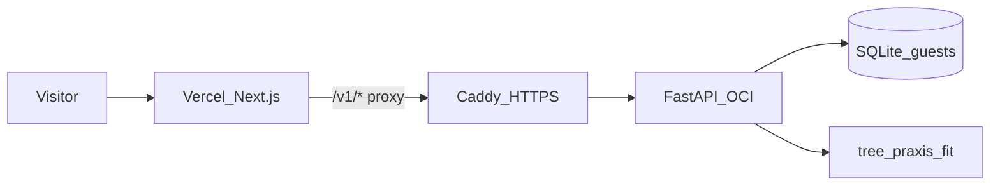

# PRAXIS Web


**PRAXIS Web** is a no-account browser workshop: load a labeled CSV (or one-click spam sample), search for short if-then rules, compare near-best options under your column constraints, score new rows, and export a scorer.

**[Live demo](https://praxis-web-nu.vercel.app)** 


[](https://github.com/Sousa-16/PRAXISWeb/releases/download/demo-assets/workshop-tour.mp4)


## My role

I designed and built the guest workshop end to end:

- Next.js 16 UI (four-step flow, polling, export)
- FastAPI jobs API (fit workers, constraints, score/freeze)
- Guest cookie isolation, abuse limits, Delete my data
- OCI Docker + Vercel proxy + Caddy/DuckDNS HTTPS path

PRAXIS / [`tree-praxis`](https://pypi.org/project/tree-praxis/) is the research algorithm (separate package and [ICML 2026 paper](https://arxiv.org/abs/2606.00202)). My contribution is the algorithm testing, product and infrastructure around it. I would like to thank the Duke University research team and the Rutgers University Center for Discrete Mathematics and Theoretical Computer Science (DIMACS) for the early-access opportunity to assist in the advancements of this algorithm, as well as my fellow DIMACS team members for the teamwork and collaboration during the testing process.


| Snapshot               |                                                                 |
| ---------------------- | --------------------------------------------------------------- |
| Workshop steps         | 4 (Load → constrain → browse → score/export)                    |
| Public `/v1` routes    | 13                                                              |
| Tests                  | 38 pytest + 4 vitest                                            |
| Guest data             | 24h TTL + one-click wipe                                        |
| Export                 | JSON rule + standalone Python scorer (+ CSV batch / TimberTrek) |
| Hosting cost           | $0 stack (Vercel hobby + OCI Always Free)                       |
| Live sample→score→wipe | ~26s in a fresh browser (spam sample → score → wipe)            |


## Project goal

Make PRAXIS usable in a browser: upload (or sample) a table, constrain features, pick a short tree you can read, then score and export, without accounts and without exposing the research package as a SaaS backend.

**Prototype / portfolio demo**: scoped for a shared guest machine, not multi-tenant production. OpenAPI is off in production. Treat uploads like data on a borrowed laptop ([SECURITY.md](SECURITY.md)).


|              |                                                   |
| ------------ | ------------------------------------------------- |
| Audience     | Recruiters, reviewers, curious practitioners      |
| Hosting      | Live on Vercel + OCI Always Free                  |
| Data model   | Ephemeral guest SQLite (24h TTL + Delete my data) |
| Not in scope | Auth, billing, multi-region HA, production SLAs   |


## Why this matters

Most “best” models hide near-equally good alternatives. A **Rashomon set** of short trees lets you choose a rule you can explain, which is useful when accuracy alone is not enough (compliance, safety, domain vetoes on features). This app turns that research idea into a guided workshop with constraints, comparison, scoring, and export.

## Product value


| For visitors                              | For operators                                   |
| ----------------------------------------- | ----------------------------------------------- |
| Zero setup: sample spam path in one click | End-to-end system design on a $0 stack          |
| Readable rules, not a black-box score     | Guest isolation, rate limits, cancelable wipe   |
| Export JSON or a standalone Python scorer | Reproducible deploy docs (OCI + Vercel + Caddy) |


## Deployment status


| Surface  | Status                                                                                                  |
| -------- | ------------------------------------------------------------------------------------------------------- |
| Frontend | **Live**: [praxis-web-nu.vercel.app](https://praxis-web-nu.vercel.app)                                  |
| API      | **Live**: FastAPI on OCI behind Caddy/DuckDNS (proxied; not for direct visitor use)                     |
| CI       | GitHub Actions on `main` ([workflow](https://github.com/Sousa-16/PRAXISWeb/actions/workflows/test.yml)) |
| Cost     | Designed for Always Free OCI + Vercel hobby                                                             |


Runbooks: [DEPLOYMENT.md](DEPLOYMENT.md) · [DEPLOYMENT_OCI.md](DEPLOYMENT_OCI.md) · [ops/CADDY_DUCKDNS.md](ops/CADDY_DUCKDNS.md).

## Key features

- **Four-step workshop**: Load → constrain → browse → score/export
- **Sample spam dataset**: UCI Spambase-based demo CSV ([provenance](api/data/README.md))
- **Feature constraints**: won't-have / must-use columns with live survivor counts
- **Rashomon browsing**: pick among short near-best trees
- **Score & export**: single row, batch CSV, impact preview, JSON + offline Python scorer
- **Guest safety**: session ownership, rate limits, 24h TTL, one-click wipe (cancels in-flight fits)


## Architecture




Visitors only use the Vercel URL. Next.js proxies `/v1/*`, attaches the guest cookie, and can forward client IP when `PRAXIS_PROXY_SECRET` matches. Fits run in background threads on the VM; the UI polls job status.

Deeper write-up: [How the model and UI interact](docs/how-model-and-ui-interact.md).

### Engineering trade-offs


| Choice                    | Why                                             | Trade-off                                        |
| ------------------------- | ----------------------------------------------- | ------------------------------------------------ |
| SQLite guest store        | Zero ops cost; simple ownership by `session_id` | Single-VM write contention; not multi-region     |
| Fit in background threads | Cancelable wipe without a job queue service     | One VM CPU/RAM budget; global job semaphore      |
| HttpOnly guest cookie     | No accounts; browser-tied isolation             | Shared-machine / cookie-clear resets session     |
| Vercel → Caddy proxy      | Keep API origin private; same-origin `/v1`      | Proxy secret + IP forwarding must stay in sync   |
| 24h guest TTL             | Demo hygiene without manual cleanup             | Long analyses must finish (or re-run) within TTL |


Request path (short): cookie issued → UI calls same-origin `/v1` → Next proxies to OCI → fit thread + poll → constrain / freeze / score / export. Full sequence: [docs/how-model-and-ui-interact.md](docs/how-model-and-ui-interact.md).

### Stack


| Layer     | Tech                                                   |
| --------- | ------------------------------------------------------ |
| Frontend  | Next.js 16 (App Router), TypeScript on Vercel          |
| Backend   | FastAPI, SQLAlchemy, SQLite in Docker on OCI           |
| HTTPS API | Caddy + DuckDNS                                        |
| Algorithm | [`tree-praxis`](https://pypi.org/project/tree-praxis/) |


### API (`/v1`)


| Method   | Path                        | Purpose                         |
| -------- | --------------------------- | ------------------------------- |
| `GET`    | `/v1/me`                    | Guest session limits / notice   |
| `DELETE` | `/v1/me/data`               | Wipe this browser’s guest data  |
| `POST`   | `/v1/datasets`              | Upload labeled CSV              |
| `POST`   | `/v1/datasets/sample`       | Load spam sample                |
| `POST`   | `/v1/jobs`                  | Start PRAXIS search             |
| `GET`    | `/v1/jobs/{id}`             | Job status / result             |
| `POST`   | `/v1/jobs/{id}/profile`     | Profile trees under constraints |
| `POST`   | `/v1/jobs/{id}/match_count` | Live surviving-tree count       |
| `POST`   | `/v1/jobs/{id}/timbertrek`  | TimberTrek HierarchyJSON export |
| `POST`   | `/v1/jobs/{id}/score`       | Score one row                   |
| `POST`   | `/v1/jobs/{id}/freeze`      | Freeze rule for export          |
| `POST`   | `/v1/jobs/{id}/score_batch` | Score uploaded CSV              |
| `POST`   | `/v1/jobs/{id}/impact`      | Impact preview on original file |


## Setup instructions


### Docker (recommended)

```bash
docker compose up --build
```

- Web: [http://localhost:3000](http://localhost:3000)
- API: [http://localhost:8765](http://localhost:8765)


### Without Docker

```bash
# terminal 1: API
cd api && python -m venv .venv && source .venv/bin/activate
pip install -r requirements.txt
uvicorn app.main:app --host 127.0.0.1 --port 8765 --reload

# terminal 2: web
cd web && npm ci && npm run dev
```

Copy [api/.env.example](api/.env.example) and [web/.env.example](web/.env.example) for local overrides.

### Tests

```bash
cd api && python -m pytest tests/ -q
cd web && npx tsc --noEmit && npm test && npm run build
```


### Repo map


| Path    | Role                               |
| ------- | ---------------------------------- |
| `web/`  | Next.js frontend (no DB client)    |
| `api/`  | FastAPI + SQLite guest store       |
| `ops/`  | Caddy / DuckDNS / backup runbooks  |
| `docs/` | Screenshots, tour video, write-ups |


## Technical write-up

**[How the model and UI interact](docs/how-model-and-ui-interact.md)**: cookie → job poll → fit → constrain → freeze/score/export

## License

[MIT](LICENSE). Copyright (c) 2026 Matheus Sousa
