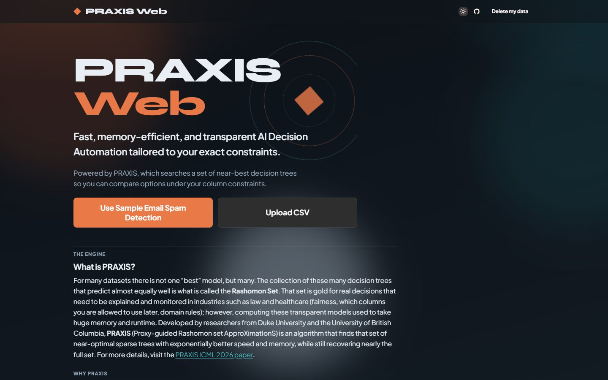
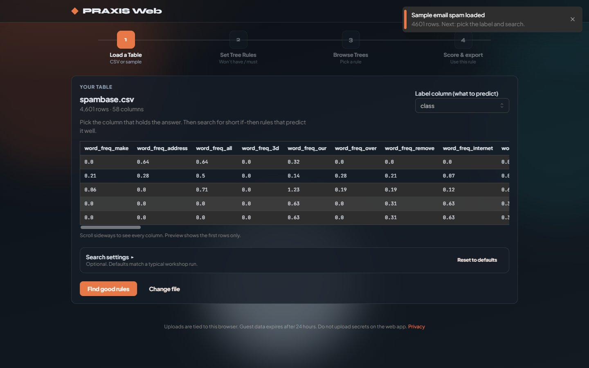
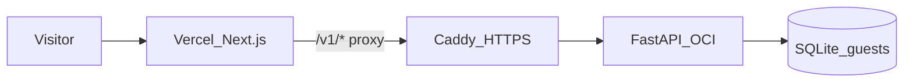

# PRAXIS Web

[](LICENSE)
[](https://github.com/Sousa-16/PRAXISWeb/actions/workflows/test.yml)
[](web/package.json)
[](api/requirements.txt)

Find short, readable if-then rules from a labeled CSV, compare near-best trees, and score new rows with the rule you pick.

**[Live demo → https://praxis-web-nu.vercel.app](https://praxis-web-nu.vercel.app)**

<p>
  
</p>
<p>
  
</p>

<video src="docs/images/workshop-tour.mp4" controls width="960" title="PRAXIS Web workshop tour through Score &amp; export">
  <a href="docs/images/workshop-tour.mp4">Watch the workshop tour (MP4)</a>
</video>

## My contribution

I built this **guest workshop**: Next.js UI, FastAPI jobs API, feature constraints, score/export, guest isolation, and the OCI + Vercel deploy path.

The search algorithm itself is **PRAXIS** ([`tree-praxis`](https://pypi.org/project/tree-praxis/)), a separate research package described in the [ICML 2026 paper](https://arxiv.org/abs/2606.00202).

## Why this matters

Most “best” models hide alternatives that are almost as accurate. PRAXIS surfaces a **Rashomon set** of short trees so you can pick a rule you can read and defend. This app adds a browser workshop around that idea: constrain features, compare survivors, score new rows, and export — with guest isolation, rate limits, and a one-click data wipe.

## What it is

A four-step guest workshop:

1. **Load a Table**: sample email spam or your CSV; optional search settings
2. **Set Tree Rules**: mark columns as won’t-have or must-use
3. **Browse Trees**: pick a surviving rule
4. **Score & export**: score a row or CSV, preview impact, download JSON or a standalone Python scorer

Sample CSV provenance: [api/data/README.md](api/data/README.md).

## Stack

| Layer | Tech |
|-------|------|
| Frontend | Next.js 16 (App Router), TypeScript, hosted on Vercel |
| Backend | FastAPI, SQLAlchemy, SQLite guest store, Docker on OCI |
| HTTPS API | Caddy + DuckDNS (stable hostname for the Vercel proxy) |
| Algorithm | [`tree-praxis`](https://pypi.org/project/tree-praxis/) (separate package) |

## Architecture



Visitors only use the Vercel URL. The Next.js app proxies API calls and forwards the visitor IP when `PRAXIS_PROXY_SECRET` matches on both sides. See [DEPLOYMENT.md](DEPLOYMENT.md) and [SECURITY.md](SECURITY.md).

## API (compact)

OpenAPI/Swagger is off in production. Main routes (all under the proxied `/v1` path from the web app):

| Method | Path | Purpose |
|--------|------|---------|
| `POST` | `/v1/datasets` | Upload a labeled CSV |
| `POST` | `/v1/datasets/sample` | Load the built-in spam sample |
| `POST` | `/v1/jobs` | Start a PRAXIS search |
| `GET` | `/v1/jobs/{id}` | Job status / result |
| `POST` | `/v1/jobs/{id}/profile` | Feature profile for constraints |
| `POST` | `/v1/jobs/{id}/score` | Score one row with a frozen tree |
| `POST` | `/v1/jobs/{id}/freeze` | Persist the chosen tree for export |
| `DELETE` | `/v1/me/data` | Wipe this browser’s guest data |

## Try it

On the live site, click **Use Sample Email Spam Detection**, or upload a labeled CSV.

Do not upload secrets or personal data you would not put on a shared demo machine. Guest uploads are tied to this browser, expire after 24 hours, and can be wiped with **Delete my data**. See [Privacy](https://praxis-web-nu.vercel.app/privacy) and [SECURITY.md](SECURITY.md).

## Local run

**Docker (API + web)** from the repo root:

```bash
docker compose up --build
```

- Web: http://localhost:3000
- API: http://localhost:8765

**Without Docker:**

```bash
# terminal 1
cd api && uvicorn app.main:app --host 127.0.0.1 --port 8765 --reload

# terminal 2
cd web && npm ci && npm run dev
```

Copy [api/.env.example](api/.env.example) and [web/.env.example](web/.env.example) if you need local overrides.

## Repo map

- **web/** — Next.js frontend (Vercel). No database client.
- **api/** — FastAPI backend (OCI / Docker). Guest data is **SQLite** (`DATABASE_URL`).
- **ops/** — DuckDNS + Caddy runbook for the stable API URL

## Tests

```bash
cd api && python -m pytest tests/ -q
cd web && npx tsc --noEmit && npm test && npm run build
```

See [CONTRIBUTING.md](CONTRIBUTING.md) for PR expectations.

## Deploy

Overview: [DEPLOYMENT.md](DEPLOYMENT.md). OCI + Vercel ($0): [DEPLOYMENT_OCI.md](DEPLOYMENT_OCI.md). Stable API hostname: [ops/CADDY_DUCKDNS.md](ops/CADDY_DUCKDNS.md). Backups: [ops/BACKUP.md](ops/BACKUP.md).

## License

[MIT](LICENSE) — Copyright (c) 2026 Matheus Sousa
