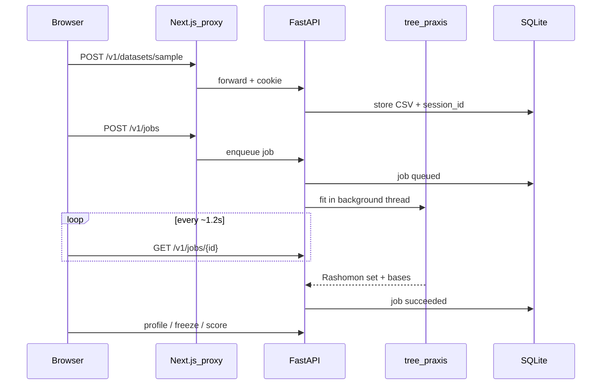

# How the model and UI interact

PRAXIS Web is a **browser workshop** around the research package [`tree-praxis`](https://pypi.org/project/tree-praxis/). The Next.js UI never runs the search; FastAPI does. The UI owns wizard state, polling, and export formatting.

## Request path

1. Visitor opens `https://praxis-web-nu.vercel.app`.
2. Middleware issues an HttpOnly guest cookie (`praxis_web_sid`).
3. The workshop calls same-origin `/v1/...` with credentials.
4. Next.js proxies to Caddy → FastAPI on OCI, forwarding the cookie and (when secrets match) the real client IP for rate limits.

## Workshop stages ↔ API

| UI step         | Client responsibility                               | Server responsibility                                                    |
| --------------- | --------------------------------------------------- | ------------------------------------------------------------------------ |
| Load a Table    | Pick sample or upload; choose label                 | Persist CSV under the guest session                                      |
| Find good rules | Poll job status                                     | Run `PRAXIS().fit` (capped rows/trees); write a result shell + fit cache |
| Set Tree Rules  | Toggle won’t-have / must-use; debounce match counts | Bitmask filter over bases; optional profile of ≤2000 surviving trees     |
| Browse Trees    | Pick a short tree from the profiled set             | Serve profiled trees from `result_json`                                  |
| Score & export  | Build offline Python/JSON scorer client-side        | Freeze rule payload; score row/CSV; impact preview                       |

Key orchestration lives in `web/hooks/useWorkshop.ts` and `api/app/main.py`. Fit work is in `api/app/fit.py` / `jobs_runner.py` (daemon thread + global semaphore). Export helpers are in `web/lib/policyExport.ts`.

## Why this split

- **CPU/RAM** for PRAXIS stays on a single cheap VM; Vercel stays a thin UI + proxy.
- **Guest isolation** is row-level (`session_id`) plus CORS locked to the frontend origin.
- **Long fits** release the SQLite session so **Delete my data** can cancel and wipe without waiting for the search to finish.

For limits and threat model, see [SECURITY.md](../SECURITY.md). For deploy topology, see [DEPLOYMENT.md](../DEPLOYMENT.md).